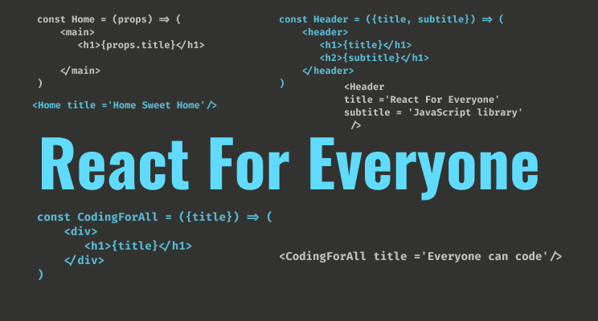
- [Introduction](#introduction)
- [1. What is React ?](#1-what-is-react)
  - [Exercises](#exercises)
- [2. Why React ?](#2-why-react)
  - [Exercises: React](#exercises-react)
- [3. JSX](#3-jsx)
  - [Exercises](#exercises-1)
- [JSX Element](#jsx-element)
  - [Exercises:JSX](#exercisesjsx)
- [Rendering JSX Element](#rendering-jsx-element)
- [Style and className](#style-and-classname)
  - [Exercises - Inline Style](#exercises---inline-style)
  - [Exercises - Internal Styles](#exercises---internal-styles)
- [Injecting data to JSX Element](#injecting-data-to-jsx-element)
  - [Injecting a string to JSX Element](#injecting-a-string-to-jsx-element)
  - [Injecting a number to JSX Element](#injecting-a-number-to-jsx-element)
  - [Injecting an array to JSX Element](#injecting-an-array-to-jsx-element)
  - [Injecting an object to JSX Element](#injecting-an-object-to-jsx-element)
  - [Exercise: Inject data to JSX](#exercise-inject-data-to-jsx)
- [Component](#component)
- [Rendering components](#rendering-components)
  - [Class Components](#class-components)
- [Props](#props)
  - [Props in Functional Component](#props-in-functional-component)
    - [propTypes](#proptypes)
    - [defaultProps](#defaultprops)
    - [Destructuring props](#destructuring-props)
  - [Props in Class Components](#props-in-class-components)
  - [Rendering lists](#rendering-lists)
- [Creating a react project](#creating-a-react-project)
- [Events](#events)
- [State](#state)
- [Class Component and Functional Component](#class-component-and-functional-component)
- [Container and Presentation component](#container-and-presentation-component)
- [React Form](#react-form)
- [Controlled and uncontrolled inputs](#controlled-and-uncontrolled-inputs)
- [Conditional Rendering](#conditional-rendering)
  - [Using if condition](#using-if-condition)
  - [Using ternary operators](#using-ternary-operators)
  - [Using and operator](#using-and-operator)
- [Component Life cycles](#component-life-cycles)
- [React Router](#react-router)
- [React Hooks](#react-hooks)

## Introduction

Prerequisite to get started with React. You should have a good understanding of the following technologies:

- HTML
- CSS
- JavaScript

If you have the above skills you will enjoy doing react.
React for Everyone contains anything you need to know about react. In every section, it has some exercise and mini-projects and it is recommended to work them.

## 1. What is React ?

React is a JavaScript library for building user interfaces. It was initially released on May 29, 2013. The current version is 16.12.0 and somehow it is stable. React was created by Facebook. It is a tool for building UI components. When we work with react we do not interact directly with the DOM. React has its own way to handle the DOM(Document Object Model) manipulation which is the virtual DOM. Do not directly interact with DOM when you build react application leave that job for the virtual DOM.

To summarize:

- React was released in May 2013
- React was created by Facebook
- React is a JavaScript library for building user interfaces
- React is used to build single page applications- An application which has only one HTML page.
- React allows us to create reusable UI components
- React latest release is 16.12.0

### Exercises

1. What is React?
2. What is a library ?
3. What is single page application ?
4. What is component ?
5. What is the latest version of react ?
6. What is DOM ?

## 2. Why React ?

React is one of the most popular JavaScript library. Many developers and companies have been using it for the last couple of years. Its popularity has been growing fast and it has a huge community. How do we measure popularity? One measure of could be github, let us compare the popularity of [react](https://github.com/facebook/react) and [vue](https://github.com/vuejs/vue). As of today, the popularity between the two most popular JavaScript looks like as follows. From the diagram you can tell yourself which is more popular, I will leave this for you.

React Official Github Repository

 

Vue Official Github Repository


Why we choose to use react ? We use react because of the following reasons:

- fast
- modular
- scalable
- flexible
- big community and popular
- open source

### Exercises: React

1. Why you chose to use react?
2. How measures do you use to know popularity ?
3. What is more popular, react or vue ?

## 3. JSX

JSX stands for JavaScript XML. JSX allows us to write HTML elements with JavaScript code. An HTML element has an opening and closing tag, content, and attribute in the opening tag. However, some HTML tag may not have a content and a closing tag, they are self closing elements. To create HTML elements in React we do not use the _createElement()_ instead we just use JSX elements. Therefore, JSX makes it easier to write and add HTML elements in React. JSX will be converted to JavaScript on browser using transpiler which [babel.js](https://babeljs.io/). Babeb is a library which transpile JSX to pure JavaScript and latest JavaScript to older version.  See the JSX code below.

```js
const jsxElement = <h1>I am a JSX element</h1>
```

The above strange looking code seems a JavaScrip but it is not JavaScript and it seems an HTML but not completely an HTML element. It is a mix of JavaScript and and an HTML element. JSX can allow us to use HTML in JavaScript. The HTML element in the above JSX is h1.

### Exercises

1. What is an HTML element ?
2. Write a self closing elements ?
3. What is HTML attribute, write some HTML attributes
4. What is JSX ?
5. What is babel ?
6. What is a transpiler?
  
## JSX Element

As you have seen in the above example, JSX has a JavaScript and HTML like syntax. JSX element could be a single HTML element or many HTML elements wrapped in a parent HTML element.

This JSX element has only on HTML element which is h1.

```js
const jsxElement = <h1>I am a JSX element</h1>
```

Let's make more JSX elements by declaring a new variable name title and content inside h1.

```js
const title = <h1>Getting Started React</h1>
```

Let us add a subtitle to the above JSX element by adding additional HTML element. Every HTML element should be wrapped by an outer HTML element to create a valid JSX element. The name title variable also should be changed to header because our JSX element is containing almost all the header of the application.

```js
const header = (
  <header>
    <h1>Getting Started React</h1>
    <h2>JavaScript Library</h2>
  </header>
)
```

Let us keep adding more elements. Additional HTML element to display the author name and year.

```js
const header = (
  <header>
    <h1>Getting Started React</h1>
    <h2>JavaScript Library</h2>
    <h3>Asabeneh Yetayeh</h3>
    <p>Feb 10, 2020</p>
  </header>
)
```

As you can see the header element is a parent element for all the inner HTML elements and JSX must be wrapped by an outer parent element. Without the header HTML element or other parent HTML element the above JSX is invalid.

### Exercises:JSX

1. What is JSX element
2. Write you name in JSX element and store it in a name variable
3. Write a JSX element which displays your full name, country, title, gender, email, phone number. Use h1 for the name and p for the rest of the information and store it in a user variable.
4. Write a footer JSX element
  
## Rendering JSX Element

To render a JSX element to HTML document. We should create on index HTML. The index.html is the only HTML file you will have in any react application. That is why every react application is a single page application. Let us create an index.html file.

```html
<!DOCTYPE html>
<html lang="en">
  <head>
    <meta charset="UTF-8" />
    <meta name="viewport" content="width=device-width, initial-scale=1.0" />
    <title>React For Everyone</title>
  </head>

  <body>
    <div class="root"></div>

    <script>
  
    </script>
  </body>
</html>
```

As you can see from the above index.html, we have one div with a class root and script. The root div is the get way to connect all react component to the index.html. In the script tag, we will write our JavaScript but the script type will be babel. Babel will transpile the react JSX to pure JavaScript on the browser. Let us add babel to the script. Inside the babel, we can write any pure JavaScript, JSX and in general react code.

```html
<!DOCTYPE html>
<html lang="en">
  <head>
    <meta charset="UTF-8" />
    <meta name="viewport" content="width=device-width, initial-scale=1.0" />
    <title>React For Everyone</title>
  </head>

  <body>
    <div class="root"></div>
    <script src="https://unpkg.com/@babel/standalone/babel.min.js"></script>
    <script type="text/babel">
   // our code goes here
    </script>
  </body>
</html>
```

The babel library is linked to our document and now we can make use of it. The next step is importing React and ReactDOM using CDN or link.  Attach the react and react-dom to your file. To test if react is connected to the index.html try to check by doing console.log(React). If you see an object containing react methods then you are connected to react.

```html
<!DOCTYPE html>
<html lang="en">
  <head>
    <meta charset="UTF-8" />
    <meta name="viewport" content="width=device-width, initial-scale=1.0" />
    <title>React For Everyone</title>
  </head>

  <body>
    <div class="root"></div>

    <script
      crossorigin
      src="https://unpkg.com/react@16/umd/react.development.js"
    ></script>
    <script
      crossorigin
      src="https://unpkg.com/react-dom@16/umd/react-dom.development.js"
    ></script>
    <script src="https://unpkg.com/@babel/standalone/babel.min.js"></script>
    <script type="text/babel">
      console.log(React)
    </script>
  </body>
</html>
```

Now the index.html has everything we need to write react code. Let us get the root element using document.querySelect('.root') and assign it to variable name rootElement. The is the only place we directly interact with DOM.

Now, you knew JSX and JSX element. Let us render the JSX element on the browser, in order to do so we need the react and ReactDOM library. In addition to the React and ReactDOM we need babel to transpile the JSX to JavaScript code. The ReactDOM package has a method render. The render method takes two arguments:a JSX element or a component and the root document. See the code below. [Live on code pen](https://codepen.io/Asabeneh/full/JjdbjqK).

```html
<!DOCTYPE html>
<html lang="en">
  <head>
    <meta charset="UTF-8" />
    <meta name="viewport" content="width=device-width, initial-scale=1.0" />
    <title>React For Everyone</title>
  </head>

  <body>
    <div class="root"></div>

    <script
      crossorigin
      src="https://unpkg.com/react@16/umd/react.development.js"
    ></script>
    <script
      crossorigin
      src="https://unpkg.com/react-dom@16/umd/react-dom.development.js"
    ></script>
    <script src="https://unpkg.com/@babel/standalone/babel.min.js"></script>
    <script type="text/babel">
      // To get the root element from the HTML document
      const rootElement = document.querySelector('.root')

      // JSX element
      const jsxElement = <h1>I am a JSX element</h1>

      // we render the JSX element using the ReactDOM package
      // ReactDOM has the render method and the render method takes two argument
      ReactDOM.render(jsxElement, rootElement)
    </script>
  </body>
</html>
```

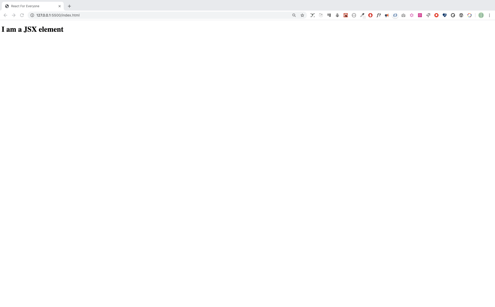

Let us render more content. To render more content the JSX element should have more HTML elements. For instance, we can create a header of a website and header may have a title, subtitle, author or date etc.
[Live on code pen](https://codepen.io/Asabeneh/full/QWbGWeY).

```html
<!DOCTYPE html>
<html lang="en">
  <head>
    <meta charset="UTF-8" />
    <meta name="viewport" content="width=device-width, initial-scale=1.0" />
    <title>React For Everyone</title>
  </head>

  <body>
    <div class="root"></div>

    <script
      crossorigin
      src="https://unpkg.com/react@16/umd/react.development.js"
    ></script>
    <script
      crossorigin
      src="https://unpkg.com/react-dom@16/umd/react-dom.development.js"
    ></script>
    <script src="https://unpkg.com/@babel/standalone/babel.min.js"></script>
    <script type="text/babel">
      // To get the root element from the HTML document
      const rootElement = document.querySelector('.root')

      // JSX element
      const header = (
        <header>
          <h1>Getting Started React</h1>
          <h2>JavaScript Library</h2>
          <p>Asabeneh Yetayeh</p>
          <p>Feb 10, 2020</p>
        </header>
      )

      // we render the JSX element using the ReactDOM package
      // ReactDOM has the render method and the render method takes two argument
      ReactDOM.render(header, rootElement)
    </script>
  </body>
</html>
```


We have created a JSX element for the header of the website. How about the main and the footer for the website? Similar to the header, let us create a JSX element for the main and the footer.

JSX element for the main part of the website.

```js
// JSX element
const main = (
  <main>
    <p>Prerequisite to get started react.js:</p>
    <ul>
      <li>HTML</li>
      <li>CSS</li>
      <li>JavaScript</li>
    </ul>
  </main>
)
```

JSX element for the footer part of the website.

```js
// JSX element
const footer = (
  <footer>
    <p>Copyright 2020</p>
  </footer>
)
```

Now, we have three JSX elements:the header, main and footer. The best way to render all the three JSX elements is by wrapping them all in a parent JSX element. To include JSX element inside another JSX element we use the curly bracket, {} and call the name of the JSX inside the curly bracket.

```js
// JSX element for the header part of the website
const header = (
  <header>
    <h1>Getting Started React</h1>
    <h2>JavaScript Library</h2>
    <p>Asabeneh Yetayeh</p>
    <p>Feb 10, 2020</p>
  </header>
)

// JSX element for the main part of the website
const main = (
  <main>
    <p>Prerequisite to get started react.js:</p>
    <ul>
      <li>HTML</li>
      <li>CSS</li>
      <li>JavaScript</li>
    </ul>
  </main>
)

// JSX element for the footer part of the website
const footer = (
  <footer>
    <p>Copyright 2020</p>
  </footer>
)

// JSX element which contain all, it is a container or parent 
const app = (
  <div>
    {header}
    {main}
    {footer}
  </div>
)
```

Now, let us put everything together and render it to the browser. [Live on code pen](https://codepen.io/Asabeneh/full/MWwbYWg).

```html
<!DOCTYPE html>
<html lang="en">
  <head>
    <meta charset="UTF-8" />
    <meta name="viewport" content="width=device-width, initial-scale=1.0" />
    <title>React For Everyone</title>
  </head>

  <body>
    <div class="root"></div>

    <script
      crossorigin
      src="https://unpkg.com/react@16/umd/react.development.js"
    ></script>
    <script
      crossorigin
      src="https://unpkg.com/react-dom@16/umd/react-dom.development.js"
    ></script>
    <script src="https://unpkg.com/@babel/standalone/babel.min.js"></script>
    <script type="text/babel">
      // To get the root element from the HTML document
      const rootElement = document.querySelector('.root')

      // JSX element, header
      const header = (
        <header>
          <h1>Getting Started React</h1>
          <h2>JavaScript Library</h2>
          <p>Asabeneh Yetayeh</p>
          <p>Feb 10, 2020</p>
        </header>
      )

      // JSX element, main
      const main = (
        <main>
          <p>Prerequisite to get started react.js:</p>
          <ul>
            <li>HTML</li>
            <li>CSS</li>
            <li> JavaScript</li>
          </ul>
        </main>
      )

      // JSX element, footer
      const footer = (
        <footer>
          <p>Copyright 2020</p>
        </footer>
      )

      // JSX element, app, a container or a parent
      const app = (
        <div>
          {header}
          {main}
          {footer}
        </div>
      )

      // we render the JSX element using the ReactDOM package
      // ReactDOM has the render method and the render method takes two argument
      ReactDOM.render(app, rootElement)
    </script>
  </body>
</html>
```

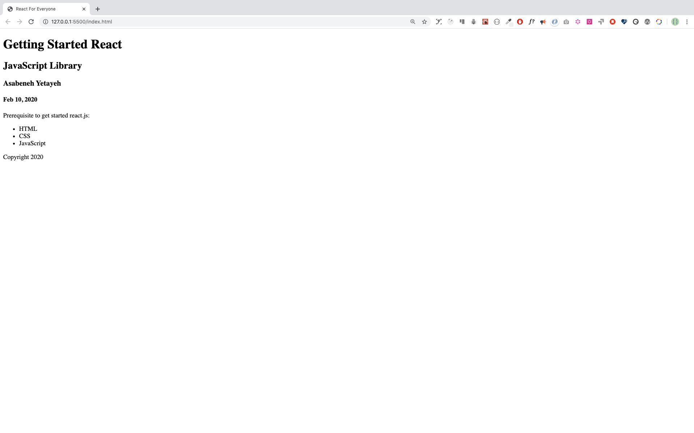

## Style and className

So far, we did apply any style. Now, let us add style to our JSX elements. Inline style became very popular after the emergence of react. Let us add border to the header JSX element.

To add style to a JSX element we use inline style or className. We inject the style object using {}. Every CSS properties become a key and every CSS properties value become value for the  the object. For instance, in the example below,  border is a key and '2px solid orange' is a value, color is a key and 'black' is a value, fontSize is a key and '18px' is a value. All two word CSS properties will change to camelCase when we use them as key in the CSS object in react or JavaScript.[Live on code pen](https://codepen.io/Asabeneh/full/ZEGBYbY).

```js
const header = (
  <header style={{ border: '2px solid orange', color:'black', fontSize:'18px' }}>
    <h1>Getting Started React</h1>
    <h2>JavaScript Library</h2>
    <p>Asabeneh Yetayeh</p>
    <p>Feb 10, 2020</p>
  </header>
)

// or we can write it

const style = { border: '2px solid orange', color:'black', fontSize:'18px' }

const header = (
  <header style={style}>
    <h1>Getting Started React</h1>
    <h2>JavaScript Library</h2>
    <h3>Asabeneh Yetayeh</h3>
    <p>Feb 10, 2020</p>
  </header>
)
```

Let us apply some style to our JSX elements and see the result.

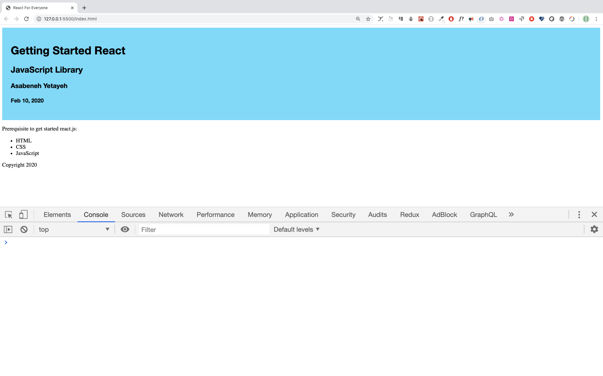.

Now, lets us apply style the header part only [Live on code pen](https://codepen.io/Asabeneh/full/ZEGBYBG).

It is good practice to open the browser console while you are developing your application to know if everything goes well.

Let us keep styling all the JSX elements we have created: the header, main and footer. We can also use regular internal styling to style our application. Using regular style, to target an HTML element we use tag name, id, class, an attribute and other methods. It is very common in the react developer community people use quite a lot classes instead of id. In this material, I will use only class instead of id.

In JSX element we write className instead of class because class is a reserved word in JavaScript. Similar to className, htmlFor instead of for in label tag. See the example below.

```js
const title = <h1 className='title'>Getting Started React</h1>
const inputField = (
  <div>
    <label htmlFor='firstname'>First Name</label>
    <input type='text' id='firstname' placeholder='First Name' />
  </div>
)
```

The id used in the input element is not for styling purpose instead to refer the label to the input field.

If class is used instead of className or for instead of htmlFor you will see such kind of warning.


Now, you know how to use the inline style and how to use className and let us style all the JSX elements.

```html
<!DOCTYPE html>
<html lang="en">
  <head>
    <meta charset="UTF-8" />
    <meta name="viewport" content="width=device-width, initial-scale=1.0" />
    <title>React For Everyone</title>
  </head>

  <body>
    <div class="root"></div>

    <script
      crossorigin
      src="https://unpkg.com/react@16/umd/react.development.js"
    ></script>
    <script
      crossorigin
      src="https://unpkg.com/react-dom@16/umd/react-dom.development.js"
    ></script>
    <script src="https://unpkg.com/@babel/standalone/babel.min.js"></script>
    <script type="text/babel">
      // To get the root element from the HTML document
      const rootElement = document.querySelector('.root')

      // style
      const headerStyles = {
        backgroundColor: '#61DBFB',
        fontFamily: 'Helvetica Neue',
        padding: 25,
        lineHeight: 1.5
      }

      // JSX element, header
      const header = (
        <header style={headerStyles}>
          <div className='header-wrapper'>
            <h1>Getting Started React</h1>
            <h2>JavaScript Library</h2>
            <p>Asabeneh Yetayeh</p>
            <p>Feb 10, 2020</p>
          </div>
        </header>
      )

      // JSX element, main
      const mainStyles = {
        backgroundColor: '#F3F0F5'
      }
      const main = (
        <main style={mainStyles}>
          <p>Prerequisite to get started react.js:</p>
          <ul>
            <li>HTML</li>
            <li>CSS</li>
            <li> JavaScript</li>
          </ul>
        </main>
      )

      const footerStyles = {
        backgroundColor: '#61DBFB'
      }
      // JSX element, footer
      const footer = (
        <footer style={footerStyles}>
          <p>Copyright 2020</p>
        </footer>
      )

      // JSX element, app
      const app = (
        <div className='app'>
          {header}
          {main}
          {footer}
        </div>
      )

      // we render the JSX element using the ReactDOM package
      ReactDOM.render(app, rootElement)
    </script>
  </body>
</html>
```

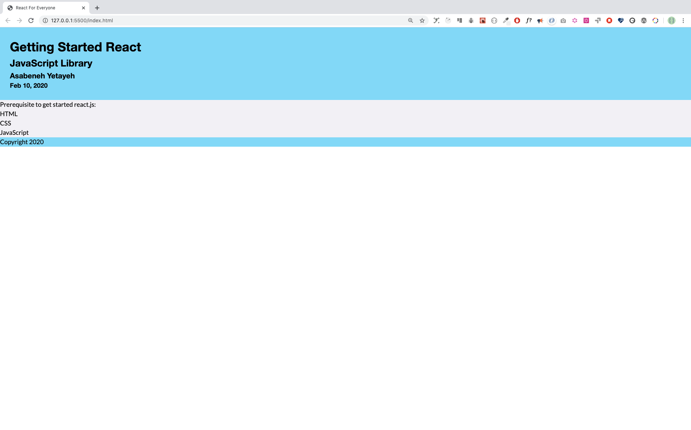

### Exercises - Inline Style

1. Create a style object for the main JSX
2. Create a style object for the footer and app JSX
3. Add more styles to the JSX elements

Instead of style object using regular styling method is more easier than the above. Now, let us use internal style to style all the JSX. It is also possible to use external style method.[Live on code pen](https://codepen.io/Asabeneh/full/QWbGwge)

```html
<!DOCTYPE html>
<html lang="en">
  <head>
    <meta charset="UTF-8" />
    <meta name="viewport" content="width=device-width, initial-scale=1.0" />
    <link
      href="https://fonts.googleapis.com/css?family=Montserrat:300,400,500|Roboto:300,400,500&display=swap"
      rel="stylesheet"
    />

    <title>React For Everyone</title>
    <style>
      /* == General style === */
      * {
        box-sizing: border-box;
        padding: 0;
        margin: 0;
      }

      html,
      body {
        height: 100%;
        line-height: 1.5;
        font-family: 'Montserrat';
        font-weight: 300;
        color: black;
      }

      .root {
        min-height: 100%;
        position: relative;
      }

      .header-wrapper,
      .main-wrapper,
      .footer-wrapper {
        width: 85%;
        margin: auto;
      }

      .header-wrapper,
      .main-wrapper {
        padding: 10px;
        margin: 2px auto;
      }

      h1 {
        font-size: 70px;
        font-weight: 300;
      }

      h2,
      h3 {
        font-weight: 300;
      }

      header {
        background-color: #61dbfb;
        padding: 25;
        padding: 10px;
      }

      main {
        padding: 10px;
        padding-bottom: 60px;
        /* Height of the footer */
      }

      ul {
        margin-left: 15px;
      }

      ul li {
        list-style: none;
      }

      footer {
        position: absolute;
        bottom: 0;
        width: 100%;
        height: 60px;
        /* Height of the footer */
        background: #6cf;
      }

      .footer-wrapper {
        font-weight: 400;
        text-align: center;
        line-height: 60px;
      }
    </style>
  </head>

  <body>
    <div class="root"></div>

    <script
      crossorigin
      src="https://unpkg.com/react@16/umd/react.development.js"
    ></script>
    <script
      crossorigin
      src="https://unpkg.com/react-dom@16/umd/react-dom.development.js"
    ></script>
    <script src="https://unpkg.com/@babel/standalone/babel.min.js"></script>
    <script type="text/babel">
      // To get the root element from the HTML document
      const rootElement = document.querySelector('.root')

      // JSX element, header
      const header = (
        <header>
          <div className='header-wrapper'>
            <h1>Getting Started React</h1>
            <h2>JavaScript Library</h2>
            <p>Instructor: Asabeneh Yetayeh</p>
            <p>Date: Feb 10, 2020</p>
          </div>
        </header>
      )

      // JSX element, main
      const main = (
        <main>
          <div className='main-wrapper'>
            <p>
              Prerequisite to get started{' '}
              <strong>
                <em>react.js</em>
              </strong>
              :
            </p>
            <ul>
              <li>HTML</li>
              <li>CSS</li>
              <li> JavaScript</li>
            </ul>
          </div>
        </main>
      )

      // JSX element, footer
      const footer = (
        <footer>
          <div className='footer-wrapper'>
            <p>Copyright 2020</p>
          </div>
        </footer>
      )

      // JSX element, app
      const app = (
        <div className='app'>
          {header}
          {main}
          {footer}
        </div>
      )

      // we render the JSX element using the ReactDOM package
      ReactDOM.render(app, rootElement)
    </script>
  </body>
</html>
```


### Exercises - Internal Styles

1. Apply different styles to you JSX elements

## Injecting data to JSX Element

So far, we used static data on the JSX elements but we also pass different data types as a dynamic data. The dynamic data could be string, number, boolean, array or object. Let us see each of the data types step by step. To inject data to a JSX we use the {} bracket.

```js
const title = 'Getting Started React'
const subtitle = 'JavaScript Library'
const authorFirstName = 'Asabeneh'
const authorLastName = 'Yetayeh'
const date = 'Feb 10, 2020'

// JSX element, header
const header = (
  <header>
    <div className='header-wrapper'>
      <h1>{title}</h1>
      <h2>{subtitle}</h2>
      <h3>
        Instructor: {authorFirstName} {authorLastName}
      </h3>
      <p>Date: {date}</p>
    </div>
  </header>
)
```

Similar to the header JSX element we can implement to main and footer JSX element.

### Injecting a string to JSX Element

In this section we only inject only strings

```js
const title = 'Getting Started React'
const subtitle = 'JavaScript Library'
const authorFirstName = 'Asabeneh'
const authorLastName = 'Yetayeh'
const date = 'Feb 10, 2020'

// JSX element, header
const header = (
  <header>
    <div className='header-wrapper'>
      <h1>{title}</h1>
      <h2>{subtitle}</h2>
      <p>
        Instructor: {authorFirstName} {authorLastName}
      </p>
      <p>Date: {date}</p>
    </div>
  </header>
)
```

### Injecting a number to JSX Element

```js
const numOne = 3
const numTwo = 2

const result = (
  <p>
    {numOne} + {numTwo} = {numOne + numTwo}
  </p>
)

const yearBorn = 1820;
const currentYear = 2020
const age = currentYear - yearBorn
const persnonAge = <p> {age}</p>
```

As you can see in the above example, it is possible to do some arithmetic calculation and ternary operations.

### Injecting an array to JSX Element

To give example for an array, let us change the HTML, CSS, JavaScript an array and inject it to the main JSX element below. We will cover in much detail in rendering lists section.

```js
const techs = ['HTML', 'CSS', 'JavaScript']

// JSX element, main
const main = (
  <main>
    <div className='main-wrapper'>
      <p>
        Prerequisite to get started{' '}
        <strong>
          <em>react.js</em>
        </strong>
        :
      </p>
      <ul>{techs}</ul>
    </div>
  </main>
)
```

### Injecting an object to JSX Element

We can inject string, number, boolean, array data to JSX but we can not directly inject object. We should extract object values first or destructure the content of the object before we inject to the JSX element. For instance, let us write firstName and lastName inside an object and extract them out to use them inside JSX.

Now, let us put everything together. Here in the example below, the data is injected dynamically to the JSX. [Live on code pen](https://codepen.io/Asabeneh/full/YzXWgpZ)

```html
<!DOCTYPE html>
<html lang="en">
  <head>
    <meta charset="UTF-8" />
    <meta name="viewport" content="width=device-width, initial-scale=1.0" />
    <link
      href="https://fonts.googleapis.com/css?family=Montserrat:300,400,500|Roboto:300,400,500&display=swap"
      rel="stylesheet"
    />

    <title>React For Everyone</title>
    <style>
      /* == General style === */
      * {
        box-sizing: border-box;
        padding: 0;
        margin: 0;
      }

      html,
      body {
        height: 100%;
        line-height: 1.5;
        font-family: 'Montserrat';
        font-weight: 300;
        color: black;
      }

      .root {
        min-height: 100%;
        position: relative;
      }

      .header-wrapper,
      .main-wrapper,
      .footer-wrapper {
        width: 85%;
        margin: auto;
      }

      .header-wrapper,
      .main-wrapper {
        padding: 10px;
        margin: 2px auto;
      }

      h1 {
        font-size: 70px;
        font-weight: 300;
      }

      h2,
      h3 {
        font-weight: 300;
      }

      header {
        background-color: #61dbfb;
        padding: 25;
        padding: 10px;
      }

      main {
        padding: 10px;
        padding-bottom: 60px;
        /* Height of the footer */
      }

      ul {
        margin-left: 15px;
      }

      ul li {
        list-style: none;
      }

      footer {
        position: absolute;
        bottom: 0;
        width: 100%;
        height: 60px;
        /* Height of the footer */
        background: #6cf;
      }

      .footer-wrapper {
        font-weight: 400;
        text-align: center;
        line-height: 60px;
      }
    </style>
  </head>

  <body>
    <div class="root"></div>

    <script
      crossorigin
      src="https://unpkg.com/react@16/umd/react.development.js"
    ></script>
    <script
      crossorigin
      src="https://unpkg.com/react-dom@16/umd/react-dom.development.js"
    ></script>
    <script src="https://unpkg.com/@babel/standalone/babel.min.js"></script>
    <script type="text/babel">
      // To get the root element from the HTML document
      const rootElement = document.querySelector('.root')
      // JSX element, header
      const title = 'Getting Started React'
      const subtitle = 'JavaScript Library'
      const author = {
        firstName:'Asabeneh',
        lastName:'Yetayeh'
      }
      const date = 'Feb 10, 2020'

      // JSX element, header
      const header = (
        <header>
          <div className='header-wrapper'>
            <h1>{title}</h1>
            <h2>{subtitle}</h2>
            <p>
              Instructor: {author.firstName} {author.lastName}
            </p>
            <p>Date: {date}</p>
          </div>
        </header>
      )

      const numOne = 3
      const numTwo = 2

      const result = (
        <p>
          {numOne} + {numTwo} = {numOne + numTwo}
        </p>
      )

      const yearBorn = 1820;
      const currentYear = 2020
      const age = currentYear - yearBorn
      const personAge = <p> {author.firstName} {author.lastName} is {age} years old</p>

      // JSX element, main
      const techs = ['HTML', 'CSS', 'JavaScript']

      // JSX element, main
      const main = (
        <main>
          <div className='main-wrapper'>
            <p>
              Prerequisite to get started{' '}
              <strong>
                <em>react.js</em>
              </strong>
              :
            </p>
            <ul>{techs}</ul>
            {result}
            {personAge}
          </div>
        </main>
      )

      const copyRight = 'Copyright 2020'

      // JSX element, footer
      const footer = (
        <footer>
          <div className='footer-wrapper'>
            <p>{copyRight}</p>
          </div>
        </footer>
      )

      // JSX element, app
      const app = (
        <div className='app'>
          {header}
          {main}
          {footer}
        </div>
      )

      // we render the JSX element using the ReactDOM package
      ReactDOM.render(app, rootElement)
    </script>
  </body>
</html>
```

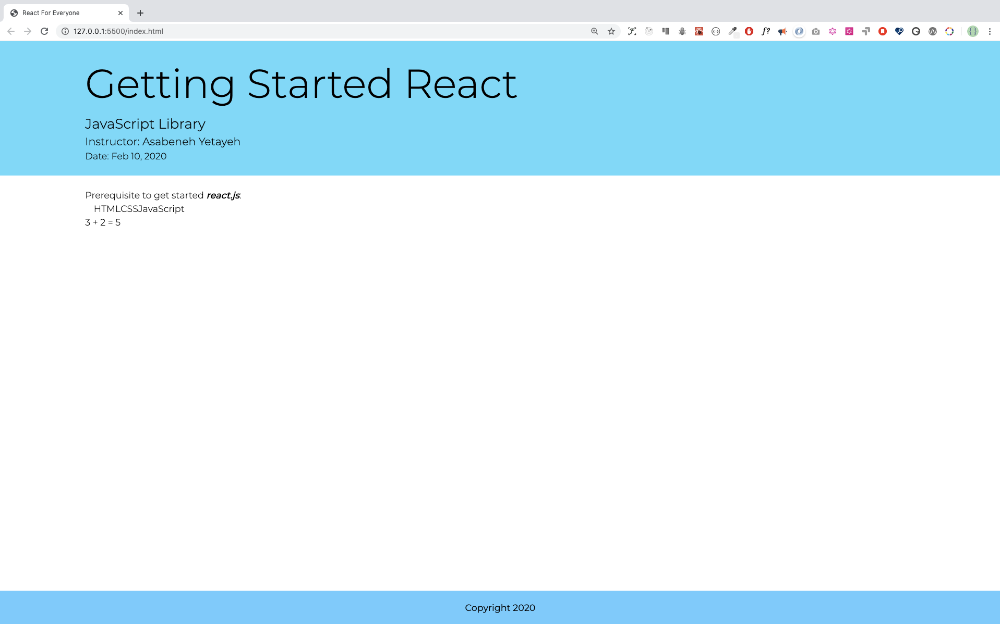

As you can see the lists are all in one line. Therefore, we should format the list the way we want before we inject to JSX. In order to format the list we should modify the array before we inject it to JSX. We can modify the array using _map_. As a react developer you should have a very good understanding of functional programming(map, filter, reduce, find, some, every).

```js
const techs = ['HTML', 'CSS', 'JavaScript']
const techsFormatted = techs.map(tech => <li>{tech}</li>)
```

In the following code example, the list is now containing list elements and formatted properly.

```html
<!DOCTYPE html>
<html lang="en">
  <head>
    <meta charset="UTF-8" />
    <meta name="viewport" content="width=device-width, initial-scale=1.0" />
    <link
      href="https://fonts.googleapis.com/css?family=Montserrat:300,400,500|Roboto:300,400,500&display=swap"
      rel="stylesheet"
    />

    <title>React For Everyone</title>
    <style>
      /* == General style === */
      * {
        box-sizing: border-box;
        padding: 0;
        margin: 0;
      }

      html,
      body {
        height: 100%;
        line-height: 1.5;
        font-family: 'Montserrat';
        font-weight: 300;
        color: black;
      }

      .root {
        min-height: 100%;
        position: relative;
      }

      .header-wrapper,
      .main-wrapper,
      .footer-wrapper {
        width: 85%;
        margin: auto;
      }

      .header-wrapper,
      .main-wrapper {
        padding: 10px;
        margin: 2px auto;
      }

      h1 {
        font-size: 70px;
        font-weight: 300;
      }

      h2,
      h3 {
        font-weight: 300;
      }

      header {
        background-color: #61dbfb;
        padding: 25;
        padding: 10px;
      }

      main {
        padding: 10px;
        padding-bottom: 60px;
        /* Height of the footer */
      }

      ul {
        margin-left: 15px;
      }

      ul li {
        list-style: none;
      }

      footer {
        position: absolute;
        bottom: 0;
        width: 100%;
        height: 60px;
        /* Height of the footer */
        background: #6cf;
      }

      .footer-wrapper {
        font-weight: 400;
        text-align: center;
        line-height: 60px;
      }
    </style>
  </head>

  <body>
    <div class="root"></div>

    <script
      crossorigin
      src="https://unpkg.com/react@16/umd/react.development.js"
    ></script>
    <script
      crossorigin
      src="https://unpkg.com/react-dom@16/umd/react-dom.development.js"
    ></script>
    <script src="https://unpkg.com/@babel/standalone/babel.min.js"></script>
    <script type="text/babel">
      // To get the root element from the HTML document
      const rootElement = document.querySelector('.root')
      // JSX element, header
      const title = 'Getting Started React'
      const subtitle = 'JavaScript Library'
      const author = {
        firstName:'Asabeneh',
        lastName:'Yetayeh'
      }
      const date = 'Feb 10, 2020'

      // JSX element, header
      const header = (
        <header>
          <div className='header-wrapper'>
            <h1>{title}</h1>
            <h2>{subtitle}</h2>
            <p>
              Instructor: {author.firstName} {author.lastName}
            </p>
            <p>Date: {date}</p>
          </div>
        </header>
      )

      const numOne = 3
      const numTwo = 2

      const result = (
        <p>
          {numOne} + {numTwo} = {numOne + numTwo}
        </p>
      )

      const yearBorn = 1820;
      const currentYear = 2020
      const age = currentYear - yearBorn
      const personAge = <p> {author.firstName} {author.lastName} is {age} years old</p>

      // JSX element, main
      const techs = ['HTML', 'CSS', 'JavaScript']
      const techsFormatted = techs.map(tech => <li>{tech}</li>)

      // JSX element, main
      const main = (
        <main>
          <div className='main-wrapper'>
            <p>
              Prerequisite to get started{' '}
              <strong>
                <em>react.js</em>
              </strong>
              :
            </p>
            <ul>{techsFormatted}</ul>
            {result}
            {personAge}
          </div>
        </main>
      )

      const copyRight = 'Copyright 2020'

      // JSX element, footer
      const footer = (
        <footer>
          <div className='footer-wrapper'>
            <p>{copyRight}</p>
          </div>
        </footer>
      )

      // JSX element, app
      const app = (
        <div className='app'>
          {header}
          {main}
          {footer}
        </div>
      )

      // we render the JSX element using the ReactDOM package
      ReactDOM.render(app, rootElement)
    </script>
  </body>
</html>
```

Rendering list

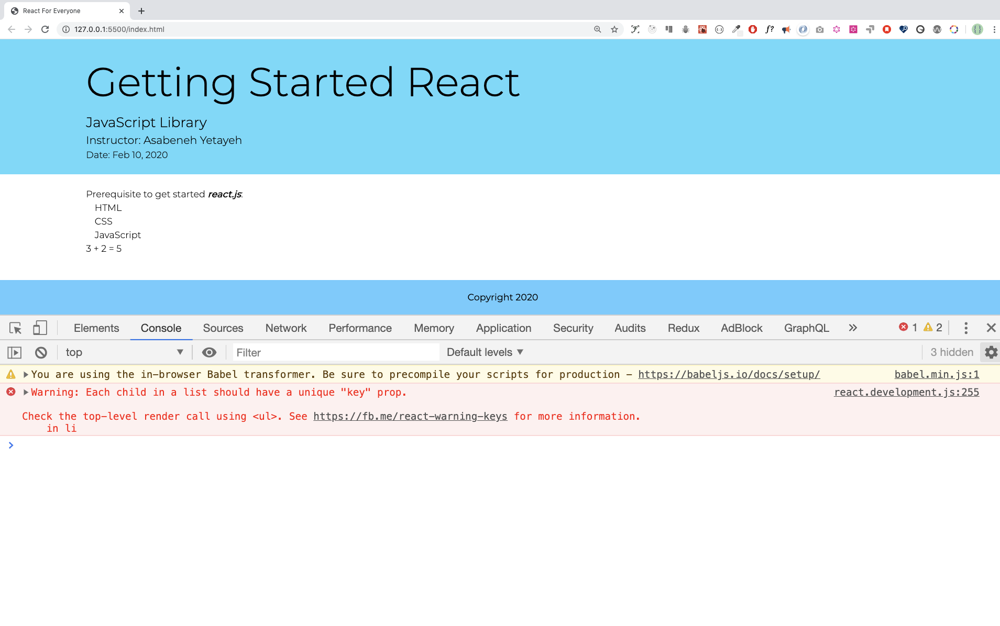
As you can see above, now the lists are formatted properly but there is warning on the console which says each list child should have a unique key. In the array, we do not have id but it is common to pass id as a unique when you have id in your data. Now, let us just pass each items us a unique key and remove the warning.

```html
<!DOCTYPE html>
<html lang="en">

<head>
    <meta charset="UTF-8">
    <meta name="viewport" content="width=device-width, initial-scale=1.0">
    <link
        href="https://fonts.googleapis.com/css?family=Montserrat:300,400,500|Roboto:300,400,500&display=swap"
        rel="stylesheet">


    <title>React For Everyone</title>
    <style>
        /* == General style === */
        * {
            box-sizing: border-box;
            padding: 0;
            margin: 0
        }


        html,
        body {
            height: 100%;
            line-height: 1.5;
            font-family: 'Montserrat';
            font-weight: 300;
            color: black;

        }

        .root {
            min-height: 100%;
            position: relative;
        }

        .header-wrapper,
        .main-wrapper,
        .footer-wrapper {
            width: 85%;
            margin: auto;

        }

        .header-wrapper,
        .main-wrapper {
            padding: 10px;
            margin: 2px auto;
        }

        h1 {
            font-size: 70px;
            font-weight: 300;
        }

        h2,
        h3 {
            font-weight: 300;
        }

        header {
            background-color: #61DBFB;
            padding: 25;
            padding: 10px;
        }

        main {
            padding: 10px;
            padding-bottom: 60px;
            /* Height of the footer */

        }

        ul {
            margin-left: 15px;
        }


        ul li {
            list-style: none;
        }

        footer {
            position: absolute;
            bottom: 0;
            width: 100%;
            height: 60px;
            /* Height of the footer */
            background: #6cf;

        }

        .footer-wrapper {
            font-weight: 400;
            text-align: center;
            line-height: 60px;
        }
    </style>
</head>

<body>
    <div class="root"> </div>

    <script crossorigin src="https://unpkg.com/react@16/umd/react.development.js"></script>
    <script crossorigin src="https://unpkg.com/react-dom@16/umd/react-dom.development.js"></script>
    <script src="https://unpkg.com/@babel/standalone/babel.min.js"></script>
    <script type="text/babel">
       // To get the root element from the HTML document
      const rootElement = document.querySelector('.root')
      // JSX element, header
      const title = 'Getting Started React'
      const subtitle = 'JavaScript Library'
      const author = {
        firstName:'Asabeneh',
        lastName:'Yetayeh'
      }
      const date = 'Feb 10, 2020'

       // JSX element, header
       const header = (
       <header>
           <div className='header-wrapper'>
               <h1>{title}</h1>
               <h2>{subtitle}</h2>
               <p>
                   Instructor: {authorFirstName} {authorLastName}
               </p>
               <p>Date: {date}</p>
           </div>
       </header>
       )

       const numOne = 3
       const numTwo = 2

       const result = (
       <p>
           {numOne} + {numTwo} = {numOne + numTwo}
       </p>
       )

      const yearBorn = 1820;
      const currentYear = 2020
      const age = currentYear - yearBorn
      const personAge = <p> {author.firstName} {author.lastName} is {age} years old</p>

       // JSX element, main
      const techs = ['HTML', 'CSS', 'JavaScript']
      const techsFormatted = techs.map((tech) => <li key={tech}>{tech}</li>)

       // JSX element, main
       const main = (
       <main>
           <div className='main-wrapper'>
               <p>
                   Prerequisite to get started{' '}
                   <strong>
                       <em>react.js</em>
                   </strong>
                   :
               </p>
               <ul>{techsFormatted}</ul>
               {result}
               {personAge}
           </div>
       </main>
       )


       const copyRight = 'Copyright 2020'

       // JSX element, footer
       const footer = (
       <footer>
           <div className="footer-wrapper">
               <p>{copyRight}</p>
           </div>

       </footer>
       )

       // JSX element, app
       const app = (
       <div className="app">
           {header}
           {main}
           {footer}
       </div>
       )

       // we render the JSX element using the ReactDOM package
       ReactDOM.render(app, rootElement)

    </script>
</body>

</html>

```


Now, you have a very good understanding of how to create JSX element and also how to inject data to JSX. In the next section, we will talk about component which are more powerful and useful than JSX.

### Exercise: Inject data to JSX

1. Practice how to make JSX element and injecting dynamic data(string, number, boolean, array, object)

## Component

A react component is small reusable code which is responsible for one part of the application UI. A react application is an aggregation of components.  React can help us to build reusable components. The following diagram shows different components. All the components have different border colors. In react we assemble different components together to create an application.

Components can be:

- Functional Component / Presentational Component / stateless component / Dumb components
- Class Component / Container Component/ State full component / smart components

The above classifications of components does not work for the latest version of react but it is good to know the former definition and how the previous versions work.


So, let us change all the JSX  to components. Components in react are JavaScript functions or class which return a JSX. Component name must start with an uppercase and if the name is two word should be CamelCase, camel with two humps.

```js
// React component stntax
// it can be arrow function, function declaration or function expression
const ComponentName = () => {
  return JSX
}
```

```js
// JSX element, header
const header = (
  <header style={headerStyles}>
    <div className='header-wrapper'>
      <h1>Getting Started React</h1>
      <h2>JavaScript Library</h2>
      <h3>Asabeneh Yetayeh</h3>
      <h4>Feb 10, 2020</h4>
    </div>
  </header>
)

// React Component
const Header = () => {
  return header
}

// or we can just return the JSX

const Header = () => {
  return (
    <header style={headerStyles}>
      <div className='header-wrapper'>
        <h1>Getting Started React</h1>
        <h2>JavaScript Library</h2>
        <h3>Asabeneh Yetayeh</h3>
        <h4>Feb 10, 2020</h4>
      </div>
    </header>
  )
}

// Even th above code can be written like this
const Header = () =>  (
    <header style={headerStyles}>
      <div className='header-wrapper'>
        <h1>Getting Started React</h1>
        <h2>JavaScript Library</h2>
        <h3>Asabeneh Yetayeh</h3>
        <h4>Feb 10, 2020</h4>
      </div>
    </header>
  )
```

## Rendering components

Now, lets change all the JSX elements we had to components. When we call JSX element we use curly brackets and when we call components we do as follows <ComponentName />. If we pass an attribute when we call the component name, we call it props(<ComponentName propsName = {'data type'} />). We will talk about props in its section.[Live on code pen](https://codepen.io/Asabeneh/full/wvaKKEM)

```html
<!DOCTYPE html>
<html lang="en">
  <head>
    <meta charset="UTF-8" />
    <meta name="viewport" content="width=device-width, initial-scale=1.0" />
    <link
      href="https://fonts.googleapis.com/css?family=Montserrat:300,400,500|Roboto:300,400,500&display=swap"
      rel="stylesheet"
    />

    <title>React For Everyone</title>
    <style>
      /* == General style === */
      * {
        box-sizing: border-box;
        padding: 0;
        margin: 0;
      }

      html,
      body {
        height: 100%;
        line-height: 1.5;
        font-family: 'Montserrat';
        font-weight: 300;
        color: black;
      }

      .root {
        min-height: 100%;
        position: relative;
      }

      .header-wrapper,
      .main-wrapper,
      .footer-wrapper {
        width: 85%;
        margin: auto;
      }

      .header-wrapper,
      .main-wrapper {
        padding: 10px;
        margin: 2px auto;
      }

      h1 {
        font-size: 70px;
        font-weight: 300;
      }

      h2,
      h3 {
        font-weight: 300;
      }

      header {
        background-color: #61dbfb;
        padding: 25;
        padding: 10px;
      }

      main {
        padding: 10px;
        padding-bottom: 60px;
        /* Height of the footer */
      }

      ul {
        margin-left: 15px;
      }

      ul li {
        list-style: none;
      }

      footer {
        position: absolute;
        bottom: 0;
        width: 100%;
        height: 60px;
        /* Height of the footer */
        background: #6cf;
      }

      .footer-wrapper {
        font-weight: 400;
        text-align: center;
        line-height: 60px;
      }
    </style>
  </head>

  <body>
    <div class="root"></div>

    <script
      crossorigin
      src="https://unpkg.com/react@16/umd/react.development.js"
    ></script>
    <script
      crossorigin
      src="https://unpkg.com/react-dom@16/umd/react-dom.development.js"
    ></script>
    <script src="https://unpkg.com/@babel/standalone/babel.min.js"></script>
    <script type="text/babel">
      // To get the root element from the HTML document
      const rootElement = document.querySelector('.root')

      // Header Component
      const Header = () => (
        <header>
          <div className='header-wrapper'>
            <h1>Getting Started React</h1>
            <h2>JavaScript Library</h2>
            <h3>Asabeneh Yetayeh</h3>
            <p>Feb 10, 2020</p>
          </div>
        </header>
      )

      // TechList Component
      const TechList = () => {
        const techs = ['HTML', 'CSS', 'JavaScript']
        const techsFormatted = techs.map(tech => <li key={tech}>{tech}</li>)
        return techsFormatted
      }

      // Main Component
      const Main = () => (
        <main>
          <div className='main-wrapper'>
            <p>Prerequisite to get started react.js:</p>
            <ul>
              <TechList />
            </ul>
          </div>
        </main>
      )

      // Footer Component
      const Footer = () => (
        <footer>
          <div className='footer-wrapper'>
            <p>Copyright 2020</p>
          </div>
        </footer>
      )

      // The App, or the parent or the container component
      const App = () => (
        <div className='app'>
          <Header />
          <Main />
          <Footer />
        </div>
      )

      // we render the JSX element using the ReactDOM package
      ReactDOM.render(<App />, rootElement)
    </script>
  </body>
</html>
```

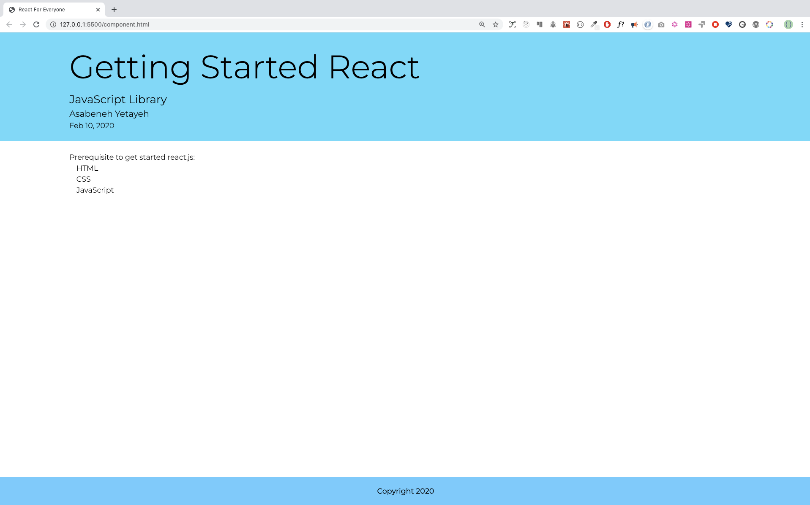

### Class Components

All the above components are functional components. Let us make also class based component. Class based component is made using JavaScript class and it inherits from react Component. Let us learn how to make a class based component by converting all the functional components we made previously. It is not important to convert all but we are converting them for the sake of learning how to change functional components to class components. [Live on code pen](https://codepen.io/Asabeneh/full/oNXjpOj)

```js
// Header Component
// Functional component
const Header = () => (
  <header>
    <div className='header-wrapper'>
      <h1>Getting Started React</h1>
      <h2>JavaScript Library</h2>
      <h3>Asabeneh Yetayeh</h3>
      <p>Feb 10, 2020</p>
    </div>
  </header>
)

// class base component

class Header extends React.Component {
  render() {
    return (
      <header>
        <div className='header-wrapper'>
          <h1>Getting Started React</h1>
          <h2>JavaScript Library</h2>
          <h3>Asabeneh Yetayeh</h3>
          <p>Feb 10, 2020</p>
        </div>
      </header>
    )
  }
}

// TechList Component
// functional component
const TechList = () => {
  const techs = ['HTML', 'CSS', 'JavaScript']
  const techsFormatted = techs.map(tech => <li key={tech}>{tech}</li>)
  return techsFormatted
}

// TechList Component
// class base component
class TechList extends React.Component {
  render() {
    const techs = ['HTML', 'CSS', 'JavaScript']
    const techsFormatted = techs.map(tech => <li key={tech}>{tech}</li>)
    return techsFormatted
  }
}

// Main Component
// Functional Component
const Main = () => (
  <main>
    <div className='main-wrapper'>
      <p>Prerequisite to get started react.js:</p>
      <ul>
        <TechList />
      </ul>
    </div>
  </main>
)

// Main Component
// Class Component
class Main extends React.Component {
  render() {
    return (
      <main>
        <div className='main-wrapper'>
          <p>Prerequisite to get started react.js:</p>
          <ul>
            <TechList />
          </ul>
        </div>
      </main>
    )
  }
}

// Footer Component
// Functional component
const Footer = () => (
  <footer>
    <div className='footer-wrapper'>
      <p>Copyright 2020</p>
    </div>
  </footer>
)

// Footer Component
// Class component
class Footer extends React.Component {
  render() {
    return (
      <footer>
        <div className='footer-wrapper'>
          <p>Copyright 2020</p>
        </div>
      </footer>
    )
  }
}

// The App, or the parent or the container component
// Functional Component
const App = () => (
  <div className='app'>
    <Header />
    <Main />
    <Footer />
  </div>
)

// The App, or the parent or the container component
// Class Component
class App extends React.Component {
  render() {
    return (
      <div className='app'>
        <Header />
        <Main />
        <Footer />
      </div>
    )
  }
}
```

Most of the time the container or the parent component can be written as class component and others as functional or presentational components. However, the latest version of react can allow us to write every component in our application only with functional components. This was impossible in previous versions.

## Props

### Props in Functional Component

In the previous section, we saw how to inject dynamic data type JSX. Now, let us see how we use dynamic data in component and also how to pass data as props.

```js
const title = 'Getting Started React'
const subtitle = 'JavaScript Library'
const author = {
  firstName:'Asabeneh',
  lastName:'Yetayeh'
}
const date = 'Feb 10, 2020'

// Header Component
const Header = () => (
  <header>
    <div className='header-wrapper'>
      <h1>{title}</h1>
      <h2>{subtitle}</h2>
      <p>{author.firstName} {author.lastName]</p>
      <p>{date}</p>
    </div>
  </header>
)
```

Instead of injecting data we can also pass the data as a props. React props is similar to parameters in function. React props is an object which you get instantly when you create a component.

```js
const title = 'Getting Started React'
const subtitle = 'JavaScript Library'
const author = {
  firstName:'Asabeneh',
  lastName:'Yetayeh'
}
const date = 'Feb 10, 2020'

// Header Component
const Header = props => (
  <header>
    <div className='header-wrapper'>
      <h1>{props.title}</h1>
      <h2>{props.subtitle}</h2>
      <h3>
        {props.author.firstName} {props.author.lastName}
      </h3>
      <p>{props.date}</p>
    </div>
  </header>
)

// The App, or the parent or the container component
// Functional Component
const App = () => (
  <div className='app'>
    <Header
      title={title}
      subtitle={subtitle}
      author={author}
      date={date}
    />
    <Main />
    <Footer />
  </div>
)
```

As you can see in the above code, the data passed as props to Header component.
[Live on code pen](https://codepen.io/Asabeneh/full/abOvEjr)

```html
<!DOCTYPE html>
<html lang="en">
  <head>
    <meta charset="UTF-8" />
    <meta name="viewport" content="width=device-width, initial-scale=1.0" />
    <link
      href="https://fonts.googleapis.com/css?family=Montserrat:300,400,500|Roboto:300,400,500&display=swap"
      rel="stylesheet"
    />

    <title>React For Everyone</title>
    <style>
      /* == General style === */
      * {
        box-sizing: border-box;
        padding: 0;
        margin: 0;
      }

      html,
      body {
        height: 100%;
        line-height: 1.5;
        font-family: 'Montserrat';
        font-weight: 300;
        color: black;
      }

      .root {
        min-height: 100%;
        position: relative;
      }

      .header-wrapper,
      .main-wrapper,
      .footer-wrapper {
        width: 85%;
        margin: auto;
      }

      .header-wrapper,
      .main-wrapper {
        padding: 10px;
        margin: 2px auto;
      }

      h1 {
        font-size: 70px;
        font-weight: 300;
      }

      h2,
      h3 {
        font-weight: 300;
      }

      header {
        background-color: #61dbfb;
        padding: 25;
        padding: 10px;
      }

      main {
        padding: 10px;
        padding-bottom: 60px;
        /* Height of the footer */
      }

      ul {
        margin-left: 15px;
      }

      ul li {
        list-style: none;
      }

      footer {
        position: absolute;
        bottom: 0;
        width: 100%;
        height: 60px;
        /* Height of the footer */
        background: #6cf;
      }

      .footer-wrapper {
        font-weight: 400;
        text-align: center;
        line-height: 60px;
      }
    </style>
  </head>

  <body>
    <div class="root"></div>

    <script
      crossorigin
      src="https://unpkg.com/react@16/umd/react.development.js"
    ></script>
    <script
      crossorigin
      src="https://unpkg.com/react-dom@16/umd/react-dom.development.js"
    ></script>
    <script src="https://unpkg.com/@babel/standalone/babel.min.js"></script>
    <script type="text/babel">
      // To get the root element from the HTML document
      const rootElement = document.querySelector('.root')

      const title = 'Getting Started React'
      const subtitle = 'JavaScript Library'
      const author = {
      firstName: 'Asabeneh',
      lastName: 'Yetayeh'
      }
      const date = 'Feb 10, 2020'
      const copyRight = 'Copyright 2020'
      const techs = ['HTML', 'CSS', 'JavaScript']

      // Header Component
      const Header = props => (
        <header>
          <div className='header-wrapper'>
            <h1>{props.title}</h1>
            <h2>{props.subtitle}</h2>
            <h3>
              {props.author.firstName} {props.author.lastName}
            </h3>
            <p>{props.date}</p>
          </div>
        </header>
      )

      // TechList Component
      const TechList = props => {
        const techsFormatted = props.techs.map(tech => (
          <li key={tech}>{tech}</li>
        ))
        return techsFormatted
      }

      // Main Component
      const Main = () => (
        <main>
          <div className='main-wrapper'>
            <p>Prerequisite to get started react.js:</p>
            <ul>
              <TechList techs={techs} />
            </ul>
          </div>
        </main>
      )

      // Footer Component
      const Footer = props => (
        <footer>
          <div className='footer-wrapper'>
            <p>{props.copyRight}</p>
          </div>
        </footer>
      )

      // The App, or the parent or the container component
      const App = () => (
        <div className='app'>
          <Header
            title={title}
            subtitle={subtitle}
            author={author}
            date={date}
          />
          <Main />
          <Footer copyRight={copyRight} />
        </div>
      )

      // we render the JSX element using the ReactDOM package
      ReactDOM.render(<App />, rootElement)
    </script>
  </body>
</html>
```

#### propTypes

So far, we are using CDN. After few lesson, we will use create-react-app to create a react project and we will start using importing packages instead of CDN. We will cover propTypes and defaultProps when we start create-react-app.

#### defaultProps

The defaultProps can be used when we want to have some default prop types for a component.

#### Destructuring props

Destructuring code to some extent makes easy to read. Let us destructure the props in Header component. Everything we passed a props is stored in props object. Therefore, props is an object and we can destructure the properties.

```js
// Header Component
const Header = (props) => (
const {title, subtitle, author, date}  = props
<header>
  <div className='header-wrapper'>
    <h1>{title}</h1>
    <h2>{subtitle}</h2>
    <h3>{author.firstName} {author.lastName}</h3>
    <p>{date}</p>
  </div>
</header>
)
```

Some developer prefer the above destructuring but I and most prefer the following:

```js
// Header Component
const Header = ({title, subtitle, author, date}) => (
<header>
  <div className='header-wrapper'>
    <h1>{title}</h1>
    <h2>{subtitle}</h2>
    <h3>{author.firstName} {author.lastName}</h3>
    <p>{date}</p>
  </div>
</header>
)
```

Let us destructure all the props in Header, TechList and Footer. See the destructure props in the following file. [Live on code pen](https://codepen.io/Asabeneh/full/RwPWxeG)

```html
<!DOCTYPE html>
<html lang="en">

<head>
  <meta charset="UTF-8" />
  <meta name="viewport" content="width=device-width, initial-scale=1.0" />
  <link
    href="https://fonts.googleapis.com/css?family=Montserrat:300,400,500|Roboto:300,400,500&display=swap"
    rel="stylesheet" />

  <title>React For Everyone</title>
  <style>
    /* == General style === */
    * {
      box-sizing: border-box;
      padding: 0;
      margin: 0;
    }

    html,
    body {
      height: 100%;
      line-height: 1.5;
      font-family: 'Montserrat';
      font-weight: 300;
      color: black;
    }

    .root {
      min-height: 100%;
      position: relative;
    }

    .header-wrapper,
    .main-wrapper,
    .footer-wrapper {
      width: 85%;
      margin: auto;
    }

    .header-wrapper,
    .main-wrapper {
      padding: 10px;
      margin: 2px auto;
    }

    h1 {
      font-size: 70px;
      font-weight: 300;
    }

    h2,
    h3 {
      font-weight: 300;
    }

    header {
      background-color: #61dbfb;
      padding: 25;
      padding: 10px;
    }

    main {
      padding: 10px;
      padding-bottom: 60px;
      /* Height of the footer */
    }

    ul {
      margin-left: 15px;
    }

    ul li {
      list-style: none;
    }

    footer {
      position: absolute;
      bottom: 0;
      width: 100%;
      height: 60px;
      /* Height of the footer */
      background: #6cf;
    }

    .footer-wrapper {
      font-weight: 400;
      text-align: center;
      line-height: 60px;
    }
  </style>
</head>

<body>
  <div class="root"></div>

  <script
    crossorigin
    src="https://unpkg.com/react@16/umd/react.development.js"></script>
  <script
    crossorigin
    src="https://unpkg.com/react-dom@16/umd/react-dom.development.js"></script>
  <script src="https://unpkg.com/@babel/standalone/babel.min.js"></script>
  <script type="text/babel">
    // To get the root element from the HTML document
const rootElement = document.querySelector('.root')

const title = 'Getting Started React'
const subtitle = 'JavaScript Library'
const author = {
 firstName: 'Asabeneh',
 lastName: 'Yetayeh'
}
const date = 'Feb 10, 2020'
const copyRight = 'Copyright 2020'
const techs = ['HTML', 'CSS', 'JavaScript']

// Header Component
const Header = ({title, subtitle, author, date}) => (
<header>
  <div className='header-wrapper'>
    <h1>{title}</h1>
    <h2>{subtitle}</h2>
    <p>{author.firstName} {author.lastName}</p>
    <p>{date}</p>
  </div>
</header>
)


// TechList Component
const TechList = ({techs}) => {
  const techsFormatted = techs.map(tech => <li key={tech}>{tech}</li>)
  return techsFormatted
}

// Main Component
const Main = () => (
  <main>
    <div className='main-wrapper'>
      <p>Prerequisite to get started react.js:</p>
      <ul>
        <TechList techs = {techs}/>
      </ul>
    </div>
  </main>
)

// Footer Component
const Footer = ({copyRight}) => (
  <footer>
    <div className='footer-wrapper'>
      <p>{copyRight}</p>
    </div>
  </footer>
)

  // The App, or the parent or the container component
 const App = () => (
 <div className='app'>
   <Header
     title={title}
     subtitle={subtitle}
     author={author}
     date={date} />
   <Main />
   <Footer copyRight = {copyRight} />
 </div>
 )

// we render the JSX element using the ReactDOM package
  ReactDOM.render(<App />, rootElement)
    </script>
</body>
</html>
```

As you can see, all the variables are declared global but most of the cases your data comes from the parent or container component. Let us move all the data to the parent component which is App. [Live on code pen](https://codepen.io/Asabeneh/full/JjdXMjp)

```html
<!DOCTYPE html>
<html lang="en">

<head>
    <meta charset="UTF-8" />
    <meta name="viewport" content="width=device-width, initial-scale=1.0" />
    <link
        href="https://fonts.googleapis.com/css?family=Montserrat:300,400,500|Roboto:300,400,500&display=swap"
        rel="stylesheet" />

    <title>React For Everyone</title>
    <style>
        /* == General style === */
        * {
            box-sizing: border-box;
            padding: 0;
            margin: 0;
        }

        html,
        body {
            height: 100%;
            line-height: 1.5;
            font-family: 'Montserrat';
            font-weight: 300;
            color: black;
        }

        .root {
            min-height: 100%;
            position: relative;
        }

        .header-wrapper,
        .main-wrapper,
        .footer-wrapper {
            width: 85%;
            margin: auto;
        }

        .header-wrapper,
        .main-wrapper {
            padding: 10px;
            margin: 2px auto;
        }

        h1 {
            font-size: 70px;
            font-weight: 300;
        }

        h2,
        h3 {
            font-weight: 300;
        }

        header {
            background-color: #61dbfb;
            padding: 25;
            padding: 10px;
        }

        main {
            padding: 10px;
            padding-bottom: 60px;
            /* Height of the footer */
        }

        ul {
            margin-left: 15px;
        }

        ul li {
            list-style: none;
        }

        footer {
            position: absolute;
            bottom: 0;
            width: 100%;
            height: 60px;
            /* Height of the footer */
            background: #6cf;
        }

        .footer-wrapper {
            font-weight: 400;
            text-align: center;
            line-height: 60px;
        }
    </style>
</head>

<body>
    <div class="root"></div>

    <script
        crossorigin
        src="https://unpkg.com/react@16/umd/react.development.js"></script>
    <script
        crossorigin
        src="https://unpkg.com/react-dom@16/umd/react-dom.development.js"></script>
    <script src="https://unpkg.com/@babel/standalone/babel.min.js"></script>
    <script type="text/babel">
        // To get the root element from the HTML document
const rootElement = document.querySelector('.root')
// Header Component
const Header = ({title, subtitle, author, date}) => (
<header>
  <div className='header-wrapper'>
    <h1>{title}</h1>
    <h2>{subtitle}</h2>
    <p>{author.firstName} {author.lastName}</p>
    <p>{date}</p>
  </div>
</header>
)


// TechList Component
const TechList = ({techs}) => {
  const techsFormatted = techs.map(tech => <li key={tech}>{tech}</li>)
  return techsFormatted
}

// Main Component
const Main = ({techs}) => {
    return (
  <main>
    <div className='main-wrapper'>
      <p>Prerequisite to get started react.js:</p>
      <ul>
        <TechList techs = {techs}/>
      </ul>
    </div>
  </main>
)
}

// Footer Component
const Footer = ({copyRight}) => (
  <footer>
    <div className='footer-wrapper'>
      <p>{copyRight}</p>
    </div>
  </footer>
)

  // The App, or the parent or the container component
 const App = () => {
  const title = 'Getting Started React'
      const subtitle = 'JavaScript Library'
      const author = {
      firstName: 'Asabeneh',
      lastName: 'Yetayeh'
      }
      const date = 'Feb 10, 2020'
      const copyRight = 'Copyright 2020'
      const techs = ['HTML', 'CSS', 'JavaScript']

   return (
 <div className='app'>
   <Header
     title={title}
     subtitle={subtitle}
     author={author}
     date={date} />
   <Main techs = {techs}/>
   <Footer copyRight = {copyRight} />
 </div>
 )
 }

// we render the JSX element using the ReactDOM package
  ReactDOM.render(<App />, rootElement)
    </script>
</body>

</html>
```

### Props in Class Components

We access the props object in class full components using the word *this*. [Live on code pen](https://codepen.io/Asabeneh/full/poJNjjV)

```html
<!DOCTYPE html>
<html lang="en">

<head>
    <meta charset="UTF-8" />
    <meta name="viewport" content="width=device-width, initial-scale=1.0" />
    <link
        href="https://fonts.googleapis.com/css?family=Montserrat:300,400,500|Roboto:300,400,500&display=swap"
        rel="stylesheet" />

    <title>React For Everyone</title>
    <style>
        /* == General style === */
        * {
            box-sizing: border-box;
            padding: 0;
            margin: 0;
        }

        html,
        body {
            height: 100%;
            line-height: 1.5;
            font-family: 'Montserrat';
            font-weight: 300;
            color: black;
        }

        .root {
            min-height: 100%;
            position: relative;
        }

        .header-wrapper,
        .main-wrapper,
        .footer-wrapper {
            width: 85%;
            margin: auto;
        }

        .header-wrapper,
        .main-wrapper {
            padding: 10px;
            margin: 2px auto;
        }

        h1 {
            font-size: 70px;
            font-weight: 300;
        }

        h2,
        h3 {
            font-weight: 300;
        }

        header {
            background-color: #61dbfb;
            padding: 25;
            padding: 10px;
        }

        main {
            padding: 10px;
            padding-bottom: 60px;
            /* Height of the footer */
        }

        ul {
            margin-left: 15px;
        }

        ul li {
            list-style: none;
        }

        footer {
            position: absolute;
            bottom: 0;
            width: 100%;
            height: 60px;
            /* Height of the footer */
            background: #6cf;
        }

        .footer-wrapper {
            font-weight: 400;
            text-align: center;
            line-height: 60px;
        }
    </style>
</head>

<body>
    <div class="root"></div>

    <script
        crossorigin
        src="https://unpkg.com/react@16/umd/react.development.js"></script>
    <script
        crossorigin
        src="https://unpkg.com/react-dom@16/umd/react-dom.development.js"></script>
    <script src="https://unpkg.com/@babel/standalone/babel.min.js"></script>
    <script type="text/babel">
        // To get the root element from the HTML document
const rootElement = document.querySelector('.root')
// Header Component
class Header  extends React.Component {
  render () {
    const {title, subtitle, author, date} = this.props
    return (
<header>
  <div className='header-wrapper'>
    <h1>{title}</h1>
    <h2>{subtitle}</h2>
    <p>{author.firstName} {author.lastName}</p>
    <p>{date}</p>
  </div>
</header>
)
  }
}


// TechList Component
class TechList extends React.Component {
  render () {
    const techsFormatted = this.props.techs.map(tech => <li key={tech}>{tech}</li>)
  return techsFormatted
  }
  
}

// Main Component
class Main extends React.Component {
  render () {
    const {techs} = this.props
  return (
  <main>
    <div className='main-wrapper'>
      <p>Prerequisite to get started react.js:</p>
      <ul>
        <TechList techs = {techs}/>
      </ul>
    </div>
  </main>
)
  }
}

// Footer Component
class Footer extends React.Component {
  render () {
    const copyRight = this.props
    return (
  <footer>
    <div className='footer-wrapper'>
      <p>{copyRight}</p>
    </div>
  </footer>
)
  }
}

  // The App, or the parent or the container component
 class App extends React.Component{
   render () {
      const title = 'Getting Started React'
      const subtitle = 'JavaScript Library'
      const author = {
      firstName: 'Asabeneh',
      lastName: 'Yetayeh'
      }
      const date = 'Feb 10, 2020'
      const copyRight = 'Copyright 2020'
      const techs = ['HTML', 'CSS', 'JavaScript']

   return (
 <div className='app'>
   <Header
     title={title}
     subtitle={subtitle}
     author={author}
     date={date} />
   <Main techs = {techs}/>
   <Footer copyRight = {copyRight} />
 </div>
 )
   }
  
 }

// we render the JSX element using the ReactDOM package
  ReactDOM.render(<App />, rootElement)
    </script>
</body>

</html>
```

### Rendering lists

Most of the time data is in the form of array or array of objects. To render this array or array of objects most of the time we modify the data using *map*. In the previous section, we have rendered the techs list using map. In this section also we will also see more examples.

In the following example, you will see how we render a number array, a string array, a countries array and skills array on the browser.

First let us start with an array of numbers:
[Live on code pen](https://codepen.io/Asabeneh/full/QWbGbQp)

```html
<!DOCTYPE html>
<html lang="en">

<head>
    <meta charset="UTF-8" />
    <meta name="viewport" content="width=device-width, initial-scale=1.0" />
    <link
        href="https://fonts.googleapis.com/css?family=Montserrat:300,400,500|Roboto:300,400,500&display=swap"
        rel="stylesheet" />
    <title>React For Everyone</title>
    <style>
        .container {
            display: flex;
            flex-direction: column;
            justify-content: center;
            align-items: center;
            font-family: 'Montserrat';
        }
    </style>
</head>

<body>
    <div class="root"></div>

    <script
        crossorigin
        src="https://unpkg.com/react@16/umd/react.development.js"></script>
    <script
        crossorigin
        src="https://unpkg.com/react-dom@16/umd/react-dom.development.js"></script>
    <script src="https://unpkg.com/@babel/standalone/babel.min.js"></script>
    <script type="text/babel">
        // To get the root element from the HTML document
const rootElement = document.querySelector('.root')

const App = () => {
  const numbers = [1, 2, 3, 4, 5]
  const list = numbers.map((num) => <p key = {num}>{num}</p>)

        return (
        <div className = 'container'>
            <div>
                <h1>Numbers List</h1>
                  {list}
            </div>
        </div>
        )
      }

  ReactDOM.render(<App />, rootElement)
    </script>
</body>

</html>
```

Let render more lists

[Live on code pen](https://codepen.io/Asabeneh/full/XWbNbEY)

```html
<!DOCTYPE html>
<html lang="en">

<head>
    <meta charset="UTF-8" />
    <meta name="viewport" content="width=device-width, initial-scale=1.0" />
    <link
        href="https://fonts.googleapis.com/css?family=Montserrat:300,400,500|Roboto:300,400,500&display=swap"
        rel="stylesheet" />
    <title>React For Everyone</title>
    <style>
        .container {
            display: flex;
            flex-direction: column;
            justify-content: center;
            align-items: center;
            font-family: 'Montserrat';
        }
    </style>
</head>

<body>
    <div class="root"></div>

    <script
        crossorigin
        src="https://unpkg.com/react@16/umd/react.development.js"></script>
    <script
        crossorigin
        src="https://unpkg.com/react-dom@16/umd/react-dom.development.js"></script>
    <script src="https://unpkg.com/@babel/standalone/babel.min.js"></script>
    <script type="text/babel">
        // To get the root element from the HTML document
const rootElement = document.querySelector('.root')


const App = () => {
  const numbers = [1, 2, 3, 4, 5]
  const skills = [['HTML', 10], ['CSS', 7], ['JavaScript', 9], ['React', 8]]
  const countries = [{name:'Finland', city:'Helsinki'},{name:'Sweden', city:'Stockholm'}, {name:'Denmark', city:'Copenhagen'}, {name:'Norway', city:'Oslo'}]

  const list = numbers.map((num) => <p key = {num}>{num}</p>)

  const countryList = countries.map(({name, city}) => <div><p>{name} {city} </p> </div>)
  
  const skillsList = skills.map(([tech, level]) => <p key = {tech}> {tech} {' '}
       {level} </p>)
      return (
      <div className = 'container'>
          <div>
              <h1>Numbers List</h1>
                {list}
          </div>
          <div>
              <h1>Technologies List</h1>
              {skillsList}
          </div>
          <div>
              <h1>Countries List</h1>
              {countryList}
          </div>
      </div>
      )
      }

  ReactDOM.render(<App />, rootElement)
    </script>
</body>
</html>
```

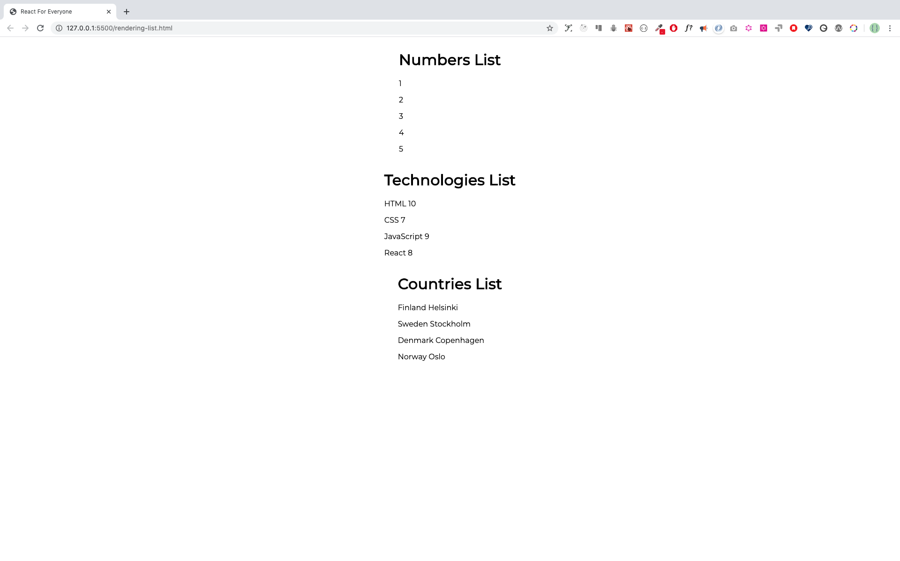

After this, we will use the *create-react-app* package to start a react project. The *create-react-app* is the standard way to create your react project.

By now you should be familiar with:

- JSX
- JSX Element
- Injected Dynamic data to JSX
- Babel
- React Component
- Props
- Passing props to components
- Rendering list
- Functional Component
- Class Based Component

## Creating a react project

From now, on we use the *create-react-app* to create react project.
First check if you have node on your machine by typing *node* on your terminal or windows command prompt.  

```sh
asabeneh $ node -v
v12.14.0
```

To create the react project you go to any directory you want your project to be and then type the following:

```sh
asabeneh $ nxp create-react-app name-of-your-project
```

After the project is created, write the following command

```sh
asabeneh $ nxp create-react-app name-of-your-project
asabeneh $ npm start
```

In other way, you can use just create-react-app followed by name of a project by installing create-react-app globally

```sh
asabeneh $ npm install create-react-app -g
asabeneh $ create-react-app name-of-your-project
asabeneh $ cd  name-of-your-project
asabeneh $ npm start
```

Now, let create a react project name react-for-everyone

```sh
asabeneh $ npx create-react-app first-react-app
asabeneh $ cd  first-react-app
asabeneh $ npm start
```

Now, your application is running at port 3000.

Let us open the file on vscode and let us the files and directories.


Let us remove the unnecessary files and create components directory, after removing you will left with following structure. All the components goes to the components folder.

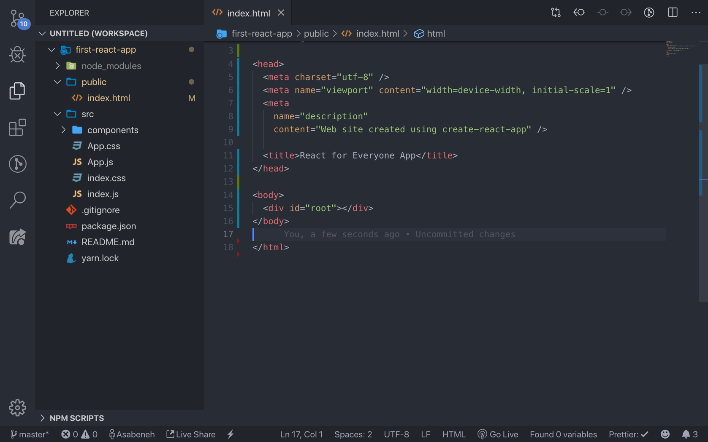

First modify the App.js file and run the application using npm start will launch the app on the browser. You will get the folder structure in the [*react-starter*](https://github.com/Asabeneh/React-For-Everyone/tree/master/react-starter) folder.

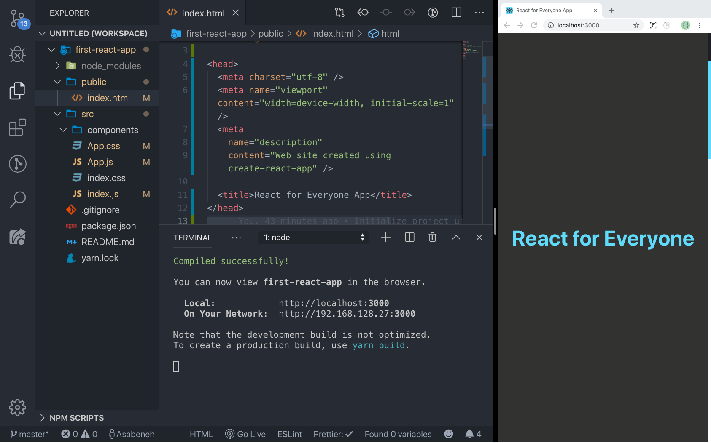

Now, lets create Header.js, Main.js, Footer.js component inside the components directory and move all the components we created in the previous section to their corresponding component file. And all the CSS to App.css fille. Finally, you will get this. You will get the code on [first-react-app](https://github.com/Asabeneh/React-For-Everyone/tree/master/first-react-app) folder.

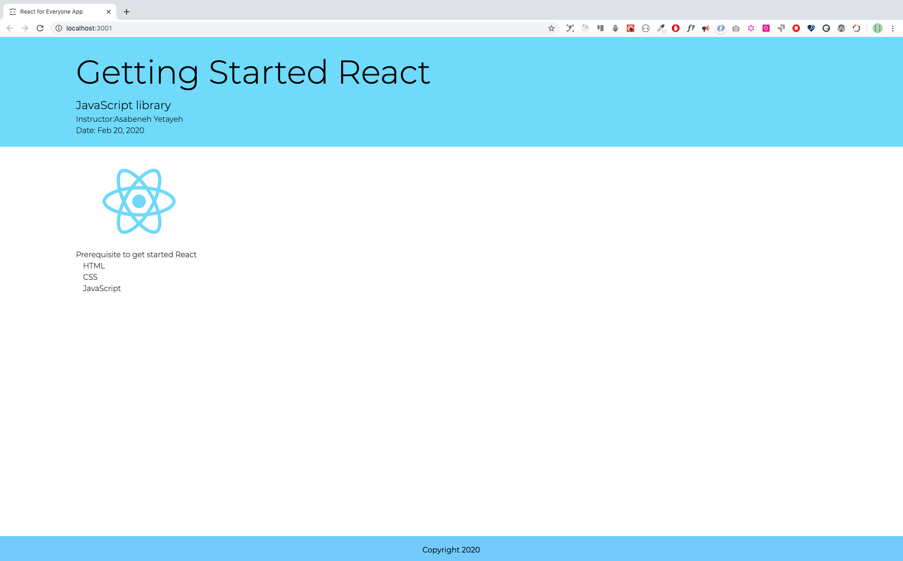

We developed a very simple react application but this application can be changed to a portfolio or a blog.

## Events

## State

## Class Component and Functional Component

## Container and Presentation component

## React Form

## Controlled and uncontrolled inputs

## Conditional Rendering

### Using if condition

### Using ternary operators

### Using and operator

## Component Life cycles

## React Router

## React Hooks
